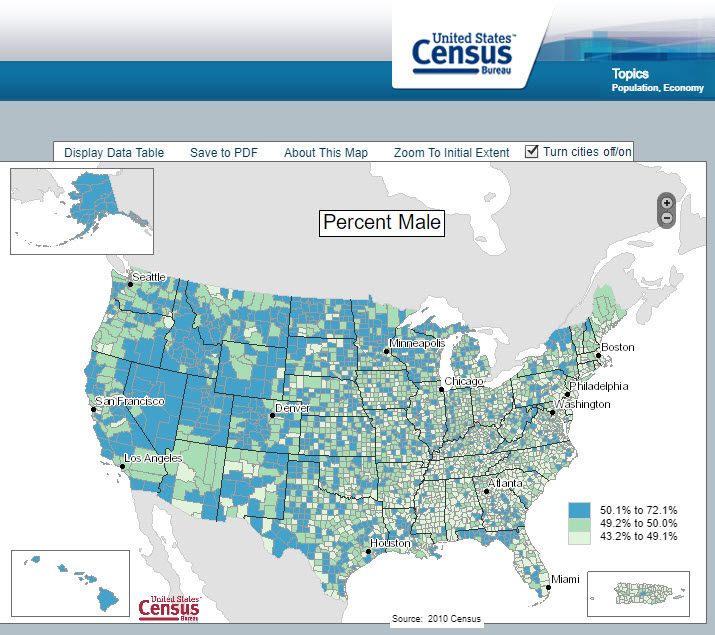

# Cesus-Data-ETL
Python ETL project to extract US Census data to single DataFrame for evaluation  

## This project is a script used to extract, transform, and load (ETL) US Census Dataset for research project.

### ETL Process:

#### 1- import csv file
#### 2- remove unused columns
#### 3- rename columns to standard column set
#### 4- correct data type, remove bad data, filter result
#### 5- export to csv file for data analysis

